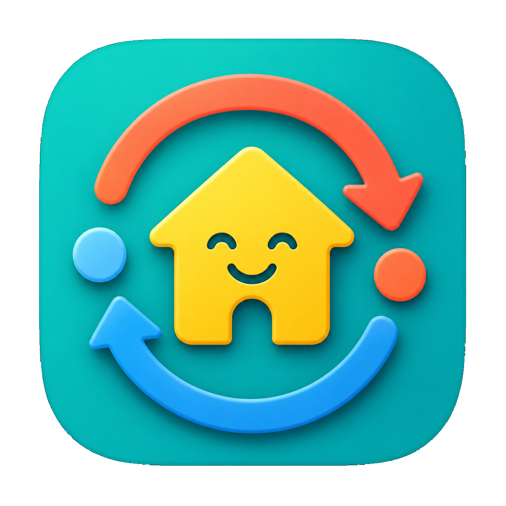

<p align="center">
  
</p>

# Domoticz Sync for Home Assistant

[](https://github.com/adrighem/ha-domoticz-sync/actions/workflows/ci.yml)
[](https://github.com/adrighem/ha-domoticz-sync/actions/workflows/codeql.yml)

This custom integration syncs device state from Domoticz into Home Assistant using the Domoticz JSON API.

It is intentionally read-only for the first version:

- Polls `/json.htm?type=command&param=getdevices&filter=all&used=true&order=Name`
- Creates Home Assistant sensors for typed Domoticz values such as temperature, humidity, pressure, power, counters, rain, wind, battery, and text values
- Creates read-only binary sensors for Domoticz switch/security states such as motion, door contact, smoke, moisture, and on/off switches
- Supports username/password Basic Auth
- Supports hidden-device and favorite-only filters through the options flow

## Installation

Copy `custom_components/domoticz_sync` into your Home Assistant `custom_components` directory and restart Home Assistant.

Then go to **Settings** -> **Devices & services** -> **Add integration** and search for **Domoticz Sync**.

## Configuration

The setup flow asks for:

- **Domoticz URL**, for example `http://192.168.1.20:8080` or `https://xmpp.vanadrighem.eu:8443/domoticz`
- **Username and password**, if your Domoticz instance requires them
- **SSL verification** for HTTPS Domoticz installations

### Syncing Only Selected Devices (Recommended)

By default, if you log in with an administrator or generic user, **all** active devices in Domoticz will be synced to Home Assistant. 

To limit the sync to a specific list of devices, we highly recommend creating a dedicated user in Domoticz:
1. In your Domoticz web interface, go to **Setup** -> **Users** and add a new user.
2. Select the newly created user in the list and click the **Set Devices** button.
3. Explicitly add only the devices you want to make visible in Home Assistant.
4. During the integration setup in Home Assistant, enter this dedicated user's **Username** and **Password**.

### Options

After setup, you can configure the following options:

- **Include hidden devices**
- **Only import favorite devices**
- **Polling interval in seconds** (how often to fetch updates from Domoticz)

## Development

Run tests from this folder:

```bash
python -m pytest
```

The parser and API client are split from Home Assistant entity code so support for more Domoticz device types can be added with focused tests.

Releases are managed by Release Please. Use Conventional Commit messages such as `fix:` and `feat:` for user-visible changes.

## Security

CodeQL, Dependency Review, pip-audit, and Dependabot are configured for this repository. Please report vulnerabilities privately through GitHub Security Advisories and do not include secrets in public issues.

## License

GPL-3.0-only. See [LICENSE](LICENSE).
